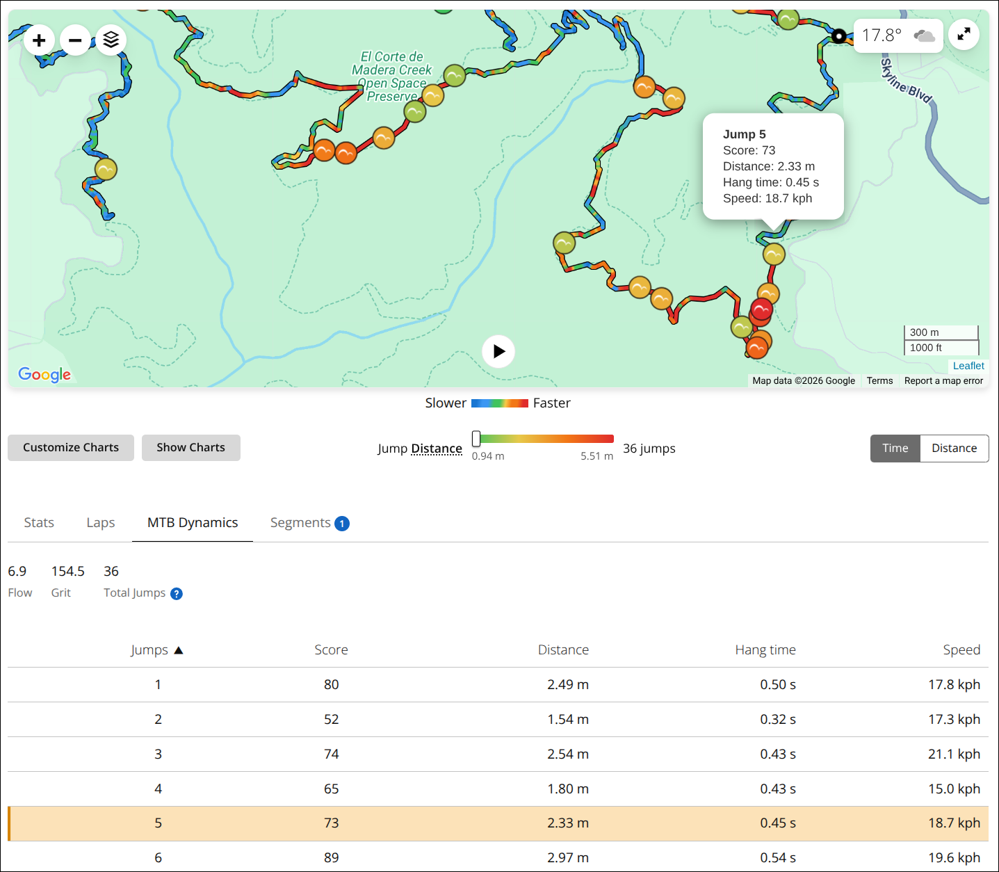
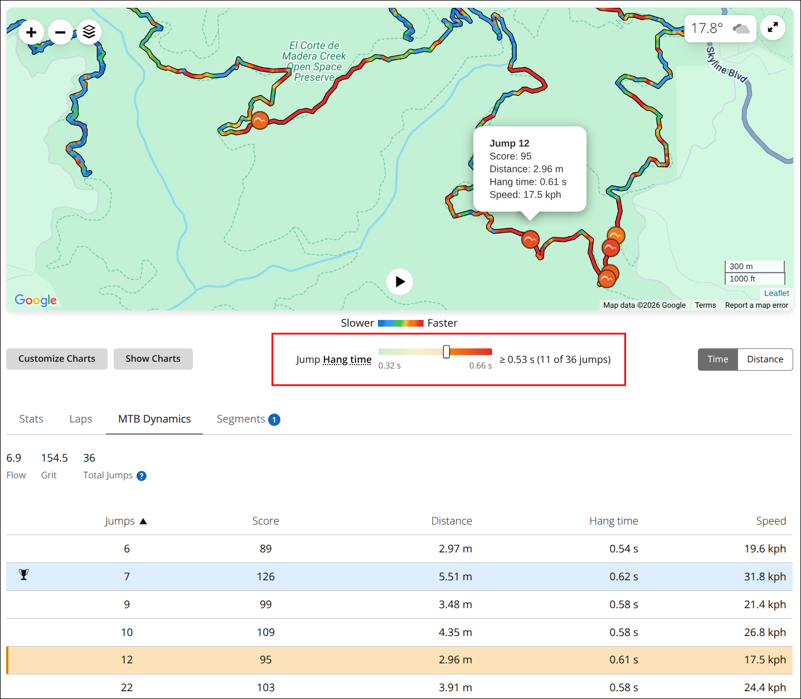

# Garmin Connect: Improve UI in MTB Dynamics jumps view

## Summary

Garmin Connect's MTB Dynamics view shows jumps on the map and in a table
below, but the UI is poor, and there's no easy way to find the larger
jumps on the map.

This script makes several improvements:

* **Link jumps on the map and in the table below.**
  * Jump info on the map includes the ID, like "Jump 3", shown in the table.
  * Click a jump on the map or in the table, and the corresponding jump is
    highlighted in both views.

* **Color-code the jumps on the map with gradient colors.** Bigger jumps are
  redder.
  * A legend for the gradient is shown below the map, with min and max values.
  * Click the dimension name to its left to switch between distance,
    hang time, and Garmin's "score".
  * Bigger jumps are drawn on top, so they are always visible, even when
    jumps overlap in zoomed-out views.

* **Filter jumps by minimum distance, hang time, or score.**
  * Move the slider on the gradient to set the filter threshold.
  * Jumps with lower values are hidden, in both the map and table.

* **Add a `Hide Charts` button** that removes the graphs between the map
  and the table below, so you don't have to scroll past them.

<!-- image-gallery-heading: **Example with a jump selected, and the same view filtered (by hang time):** -->

**Example with a jump selected:**



**The same view filtered (by hang time):**



## Visible changes

* Jump markers on the map are colored on a green→yellow→orange→red
  gradient by the selected dimension, scaled across the ride's own
  range so its smallest jump is green and its largest is red.
* Bigger jumps are drawn on top of smaller ones, so an overlapping
  cluster shows its largest jump rather than whichever happens to be
  furthest south. The stacking follows the selected dimension.
* A legend in the chart toolbar — between the Customize/Hide Charts
  buttons and the Time/Distance toggle — shows that gradient, labeled
  with the ride's smallest and largest jump. Its bar lines up with the
  left edge of Garmin's speed gradient directly above it, and holds that
  position whatever the legend's text says.
* None of the above appears on a ride with fewer than two jumps: there
  is nothing to rank one jump against, and nothing to filter it out of.
* The legend's dimension name is a button rotating through Distance,
  Hang time and Score.
* The gradient bar is also a slider. Moving it right hides every jump
  below the threshold, from the map and the jumps table at once, and
  dims the excluded end of the gradient. A popup open on a jump that
  gets hidden is closed.
* Map jump popups are titled "Jump 12" instead of "Jump", and gain a
  `Score:` line (which the table has and the popup didn't).
* Rows in the jumps table are clickable — clicking one opens that
  jump's popup on the map, panning the jump into a comfortable part of
  the map (not squeezed against an edge with the bubble clipped) and
  scrolling the map into view if it's off screen.
* The selected jump's row is highlighted in amber, whether you picked
  it from the table or from the map. It stays on the right jump when
  you re-sort the table, and clears when you close the popup.
* Row hover gets a highlight and a pointer cursor to advertise this.
* A **Hide Charts** / **Show Charts** button sits immediately right of
  Customize Charts, styled to match it, collapsing the charts so the
  map and the jumps table are on screen together. The state carries
  across activities within a session.

## Implementation

### What the page gives us

The MTB Dynamics tab and the map markers are both rendered from one
array held in React state:

```js
jumps: [{ score, hangTime, distance, timestamp, latitude, longitude, speed }, …]
```

Notably there is **no per-jump ID**. The "jump number" shown in the
table is just the 1-based array index, and the map markers are created
in the same array order. Garmin's own code therefore relies on
positional identity too — there is nothing better available.

That array is reachable, which is what the gradient and the filter are
built on. Walking up the fiber chain from the map container (or from
`.activity-charts` if the map is absent), it appears as `jumpsDetails`
on a component's props, and again one level down as
`pageProps.jumpsDetails`. We take whichever we hit first. Values are
**SI regardless of the account's display preference** — distance in
meters, hangTime in seconds, speed in m/s — so everything numeric is
computed off these and only the labels get converted.

A ride with no jumps has no array (or an empty one). A ride with exactly
one has a one-element array, which is just as useless here — a scale
whose two ends are the same number, a ranking of one, and a filter that
can only hide everything or nothing. Both cases are skipped outright, so
no legend, coloring or stacking is applied.

None of that reaches the DOM:

* **Map markers** are bare `` inside `.leaflet-marker-pane`, with
  only a pixel `transform`. No `data-*`, no id, no title.
* **Table rows** (`table[class*="mtbJumpsTable"]`) are plain `<td>`s.
  The jump number is text in cell 1; cells are
  `[icon, number, score, distance, hang time, speed]`.
* **Popup content** is bound to the marker up front, not fetched:
  clicking a marker issues no network request. The popup body is
  `<b>Jump</b>` followed by one `<div>` per metric —
  `Distance: 2.49 m` / `Hang time: 0.50 s` / `Speed: 17.8 kph`.
  No number, no score.

### How we link them

Two independent mechanisms, which cross-check each other:

1. **Popup → jump number, by metrics.** Distance + hang time + speed
   together are unique across a ride's jumps (verified on a 36-jump
   activity: zero duplicate triples), so we parse those out of the
   popup and look up the matching table row. This needs no assumption
   about ordering, and it gives us the score to add as well.

2. **Table row → marker, by position.** Marker *n* in DOM order is
   jump *n*. Verified on the live page for jumps 1, 3, 5, 7, 12, 20,
   33, 34 and 36, and geometrically: walking the 36 markers in DOM
   order traces the route (~1642 px of path) versus ~7983 px for a
   random ordering.

When the MTB Dynamics tab isn't open the table isn't in the DOM at
all, so (1) can't run; the script falls back to the index of the
marker that was clicked (tracked by a document-level capture-phase
click listener, which sees both real clicks and the synthetic ones we
make from a row click). In that case the popup gets a number but no
score.

When both are available and they disagree, we log a warning. That's
the canary for Garmin changing marker emission order, which is the
one thing direction (2) depends on.

### Selection highlight

Garmin already tints one row — the best jump — with
`rgba(84, 169, 254, 0.2)` (light blue) applied to the `<tr>` via a
`Tabs_active__*` class. Ours has to be visibly a different thing, and
has to win when both land on the same row, so it's amber
(`rgba(245, 166, 35, 0.32)` plus a 3px inset bar on the first cell)
and is declared last at higher specificity
(`table[class*="mtbJumpsTable"] tbody tr[data-mtb-jumps-selected]`
beats a bare class on the `<tr>`).

The selected jump is kept as a **number in a variable**, not as state
on a row element. Sorting the table reorders rows *and* rewrites their
cells, so a highlight pinned to an element would end up on the wrong
jump; instead a MutationObserver on `tbody` re-derives which row to
mark from the number whenever the table changes. That observer watches
`childList`/`characterData` only, never attributes, so our own
`data-mtb-jumps-selected` writes don't re-enter it.

Keeping it out of the DOM also means it survives the MTB Dynamics tab
being switched away and back, which destroys and rebuilds the table.

Selection is set from both directions (row click, and popup labelling
covers marker clicks) and cleared when the popup closes — Leaflet
removes the popup element entirely on close, which the popup-pane
observer already sees.

### Coloring the markers

The marker is an ``, not inline
SVG, so **CSS can't reach inside it** — there is no way to restyle the
disc from a stylesheet, and `filter` is too blunt for arbitrary colors.
Instead we fetch that file once, substitute its disc fill (`#6C6C6C`)
for the color we want, and set the marker's `src` to a
`data:image/svg+xml,…` URI. The white glyph and near-black ring are left
alone, so the colored disc reads clearly at 24px.

Garmin's live file is the preferred source, so an icon restyle on their
side carries into our colored copies rather than leaving us drawing a
stale icon. A verbatim copy is bundled in the script as `FALLBACK_ICON`
and used when the live one can't be had — the fetch fails (CSP, offline,
a renamed asset), or the file no longer contains a disc fill we can
substitute. Both cases log which happened.

The fallback is worth its ~1.1KB because coloring is most of the point
of the legend and the filter: without it, either failure silently costs
all three. With it, the worst case is an icon a version behind.

**Swapping `src` breaks `img[src*="/mtb/jump"]`,** which is how the rest
of this script finds markers. That's why `MARKER_SELECTOR` is now a
comma selector that also accepts `img[data-mtb-jump]`, and why the jump
number is stamped onto the marker *before* the `src` is replaced. A
comma selector still returns document order, so marker-order identity is
unaffected.

Recoloring is idempotent — without it the 1s tick would reassign `src`
every second and make Leaflet reload all 65 images — but the guard reads
the marker's **current `src`**, not a note we left ourselves. Leaflet
reuses the same `` and merely reassigns its `src` when it rebuilds a
marker, which leaves any bookkeeping attribute of ours intact. Keying off
such an attribute (`data-mtb-jump-color` did exactly this) makes the
guard short-circuit forever and strands that marker on Garmin's gray icon
while the legend still advertises a color scale.

### Stacking order

Jump markers are stacked so the biggest jump in the selected dimension is
the one drawn on top, and therefore the one you can see and click.
`applyMarkerStacking` ranks the jumps and writes each marker's depth.

**The thing that controls this is Garmin's own CSS, and it flattens
stacking completely.** Their `global.css` contains:

```css
.leaflet-zoom-animated { z-index: 9999 !important; }
```

Every Leaflet marker icon carries that class. So every marker computes to
z-index 9999 — Leaflet's own latitude-derived values are overridden too —
and once every z-index ties, paint order falls back to DOM order, which
is jump order. A big jump ends up buried under whatever jump happened to
come later in the ride.

That has a nasty consequence for anyone changing this code: **writing
`style.zIndex`, or going through Leaflet's `setZIndexOffset`, has no
visible effect at all.** Both were tried. Both produce inline values that
are provably, verifiably in the right order, and both are silently
discarded by that `!important` rule. Verifying the z-index *numbers*
passes while the map plainly disagrees — the only checks worth trusting
here read `getComputedStyle().zIndex`, or ask the browser directly with
`document.elementFromPoint()`.

The fix beats the rule at higher specificity —
`.leaflet-marker-pane img[data-mtb-jump]` is (0,2,1) against its (0,1,0)
— and takes the depth from a per-marker CSS custom property:

```css
.leaflet-marker-pane img[data-mtb-jump] {
  z-index: var(--mtb-jump-z, 10000) !important;
}
```

The custom property matters: Leaflet rewrites `style.zIndex` on every
reposition, but never touches custom properties, so the ordering survives
every pan and zoom with nothing to re-apply. The base of 10000 keeps jump
markers above the start/finish and player markers, which stay on Garmin's
flat 9999 — that is where they sit already.

**Reordering the DOM also works, and must not be used.** Marker DOM order
*is* the jump numbering that the coloring, the filter, the popup labels
and the row-click targeting all key off (`markers[i]` ↔ `jumps[i]`).
Shuffling it to fix paint order mislabeled 63 of 65 markers — and,
because every check was reading the same corrupted stamps, measured as a
clean pass. If you ever need to confirm marker identity, cross-check the
stamped number against the marker's real position via
`map._layers[…].getLatLng()` versus `jumpsDetails[n-1].latitude/longitude`;
that comes from Leaflet rather than from us and can't agree with a bug in
our own bookkeeping.

Verified after the fix: computed z-index spans 10000–10064 and sorts
identically to the metric, zero mislabeled stamps, DOM order still jump
order, and no overlapping pair painted wrong — in every dimension.

### The gradient

`GRADIENT_STOPS` is sampled straight off the pixels of Garmin's own
speed-legend `<canvas>` (the Slower→Faster bar under the map), so the
two scales read as siblings — but only the warm four of their five
stops are used:

```
#40C35D → #E7C94A → #F27716 → #E02C2C
```

Garmin's full ramp starts with two blues. Those are dropped because
blue → green → orange → red isn't monotonic in anything the eye tracks:
blue and green read as *different categories* rather than as less and
more, so a marker's color doesn't tell you where on the scale it sits
without going back to the legend. Warm-only reads as a single axis of
intensity, with luma falling steadily across it (160 → 82).

The yellow is load-bearing rather than decorative. Interpolating green
straight to orange passes through `#999D3A`, a dull olive. On the 150px
legend bar that's invisible — but on the map it isn't, because most
jumps on a ride are short and land in exactly that band, giving a map
full of olive discs on a pale green basemap. Yellow removes it without
introducing a hue that reads as a separate category.

Garmin draws a flat plateau around each stop; we interpolate smoothly
between them instead, and build the CSS `linear-gradient` for the legend
bar from the same array so the bar and the markers can't drift apart.

The scale runs **min → max of the ride** (`metricRange`), so the
smallest jump is green and the largest is red on every ride.

Anchoring the low end at 0 was tried first and gave up too much contrast.
A metric only uses the fraction of the gradient its values actually
reach, and none of these reach down to zero: scores on the reference ride
run 41–126, so a third of the ramp went unused and most markers landed
within a shade of each other. Distance was the least bad of the three
(0.47–5.25 m), which is why it became the default — a rationale that no
longer applies now that every dimension uses the full ramp.

The tradeoff is real and worth stating: colors are **relative to the
ride**, not absolute, so the same marker color means different things on
two different rides. Ranking jumps within the ride you're looking at is
what the coloring is for, so that's the right side to land on — but it
means you can't compare colors across activities.

`span` is 0 when every jump has the identical value. Callers check for
that and fall back to a flat color rather than dividing by it; the
one-jump case never reaches here at all.

### The legend, which is also the slider

The gradient bar *is* the slider track: a `<input type="range">` with a
transparent track sits over a gradient-backed `<span>`, showing only its
thumb, and a white veil (`[data-part="dim"]`) covers the filtered-out
fraction from the left. That coupling is the point — the dimmed band is
literally the range of marker colors currently hidden.

Slider position is held as a **0–1 fraction**, never as an absolute
value. That's what makes rotating the dimension keep the thumb still and
just re-derive the threshold against the new metric's range (via
`filterState`, which clamps — see Filtering). It's reset on SPA
navigation, so arriving at a new ride never starts with jumps missing.

**The chosen dimension is deliberately not persisted.** It was, in
`localStorage`, and the failure mode is worse than the convenience is
worth: one stray click on the button silently changes what every ride
opens on from then on, with nothing on screen to explain it and the fix
buried in storage. (This surfaced exactly that way — a rotation left over
from testing made every ride open on Score.) Rotating costs one click;
always starting from the same place is worth more.

It goes in as a third child of the chart toolbar row, inserted after the
cell holding Customize Charts. We anchor on the Customize Charts button
for the same reason `insertHideChartsButton` does — the toolbar's cells
render at slightly different times and its first child isn't reliably
the buttons cell.

**Its position is measured, not centered**, and both halves of that
matter:

* Letting the `space-between` row center it meant the whole control
  slid sideways whenever the readout changed width — going from
  "65 jumps" to "≥ 3.36 m (7 of 65 jumps)" visibly moved it. The label
  has a fixed width in CSS for the same reason: the three dimension
  names differ in length, and the bar must not move when they rotate.
* Centering also doesn't line up with Garmin's speed gradient above.
  Garmin's legend is centered in the page content width; ours would
  center between the Customize/Hide Charts cell and the Time/Distance
  cell, which is different math. At exactly 854px of content width the
  two happen to coincide — which is thoroughly misleading, since they
  diverge at every other width.

So `alignGroup()` measures the speed legend's `<canvas>` and sets a
left margin putting our track's left edge on the same x. The cell is
`flex: 1` so it claims the space between the other two cells and gives
the group a stable left edge to measure from; neither term in the
calculation depends on the margin being set, so it isn't circular. If
the speed legend isn't present, the group falls back to a fixed indent
— still stable, just not aligned to anything.

Below roughly 1300px of window width the toolbar row wraps and the
Time/Distance toggle drops to its own line. Nothing overlaps, and this
is Garmin's own flexbox doing it.

Speed is deliberately not one of the dimensions: Garmin's own gradient
on the route already covers it.

### Filtering

`applyFilter` computes the set of jump numbers below the threshold and
then hides both sides from that one set, so the map and the table can't
disagree. Hiding is a `data-mtb-jump-filtered` attribute plus a CSS
rule, not an inline style — React rebuilds the table on every sort and
Leaflet rewrites marker transforms constantly, and neither touches our
attributes.

The threshold is computed once in `filterState` and clamped to the
ride's max. That clamp is load-bearing: `min + 1 * (max - min)` can land
a hair *above* max in floating point — about 1% of real min/max pairs —
and the largest jump then fails `value >= threshold` as well, so dragging
the slider fully right empties the map and the table instead of leaving
the biggest jump. Score never trips it (integers); distance and hang time
can.

Table rows are matched by **the jump number in cell 1**, never by row
position, because the table is sortable. The value compared against the
threshold comes from `jumpsDetails`, not from the cell text, which is
rounded and unit-converted.

The table's MutationObserver now re-applies the filter as well as the
selection highlight, since a sort rewrites every row's cells and a tab
switch rebuilds the table outright.

A popup left open over a jump that just got hidden would float on the
map with nothing under it, so `applyFilter` closes it
(`map.closePopup()`) when the open popup's number is in the hidden set.

### Learning the distance unit

Distance is the one metric whose displayed unit varies by account, and
nothing reachable exposes the preference — `userProps.userPreferences`
comes through as `{}`. So we learn it: divide a rendered table cell by
its raw meters value and snap the ratio to the nearest known conversion
(m, ft, yd) within 2%. The largest jump is used, since the rendered
value is rounded and the biggest one gives the most accurate ratio; the
snap then removes the rounding error from the label entirely.

**Only the labels depend on this.** The colors, the ranking, the
threshold and the filtering all run on the raw `jumpsDetails` values,
which are SI whatever the account is set to, so a statute account gets a
correct scale either way — it's the two end labels and the threshold
readout that need converting.

The result is cached in `localStorage`, so later page loads label the
scale correctly before the MTB Dynamics tab has ever been opened. The
gap is the *first* visit on a statute account: the table is the only
source, so until that tab has been opened once, the labels read in
meters. Score is unitless and hang time is seconds everywhere, so
neither needs any of this.

Two things the parse has to get right, both learned the hard way:

* **Decimal commas.** A jump distance is a single digit, so a comma in
  `1,94 m` is a decimal separator, not a thousands separator. The first
  version stripped commas outright, turning `1,94` into `194` and
  yielding a ratio of 100 — a legend labeled a hundred times too large,
  silently, for every European-locale account. `parseShownDistance`
  now treats the last separator as the decimal point when 1–2 digits
  follow it, and as a group separator otherwise.
* **Refusing to guess.** An unmatched ratio used to be trusted as the
  conversion factor, which turns any misread cell into confidently wrong
  numbers. Garmin renders meters or feet, so a ratio that doesn't snap to
  a known conversion means we misread it; we now log once and keep
  showing raw meters instead.

Both were checked against m / ft / yd, 0–2 decimals, a decimal comma and
unparseable input — as one-off runs, not a committed test. This script
has no spec yet.

### Hiding the charts

The charts live in `div.activity-charts`, whose direct children are the
toolbar row (Customize Charts + the Time/Distance toggle) followed by
one element per enabled chart — 5 on an MTB ride with Flow and Grit, 3
without. `activity-charts` is a plain semantic class, not a CSS module,
so it has no build-hash suffix to rot.

Hiding is a `data-jshute-charts-hidden` attribute on `<html>` plus one
rule:

```css
html[data-jshute-charts-hidden] .activity-charts > *:not(:first-child) { display: none; }
```

Not inline styles on each chart: React rebuilds them on the
Time/Distance toggle and on any Customize Charts change, which would
wipe inline styles, and `<html>` is outside React's tree entirely so
nothing the app does can clear the flag. That's also why the state
carries across SPA navigation to another activity.

The button is inserted after the Customize Charts button, **found by
its label**. "First button in the first cell of the toolbar row" looks
equivalent and isn't: the toolbar's two cells render at slightly
different times, and running in the window where only the
Time/Distance cell exists anchors onto the "Time" button — which also
means adopting its segmented-control styling. (This happened.) The 1s
re-check also moves the button back and re-copies the className if it
ever ends up somewhere else, so a bad first placement heals itself.

The button appears on every activity page, not only MTB ones. It was
briefly gated on the MTB Dynamics tab, which created a dead end: the
hiding rule keys off `<html>` and survives SPA navigation, so hiding
the charts on an MTB ride and then navigating to a run left the charts
hidden with no button to bring them back.

### Other things worth knowing

* **Row clicks activate the marker by keyboard, not `.click()`.**
  Leaflet silently drops a synthetic click on a marker in some map
  states — reproducibly after zooming in, panning, and zooming back
  out. The click event fires on the element, but Leaflet never routes
  it to the marker (it dispatches from the map container via an
  internal target table, and markers carry no click handler of their
  own), so no popup opens. It stays that way until the user clicks a
  marker for real, which is exactly the "map highlight is stuck on one
  jump while the table keeps updating" symptom.

  The markers are `tabindex="0" role="button"`, and Leaflet's keyboard
  path opened the popup in every state we could produce, including the
  broken one. So we `focus({preventScroll: true})` and dispatch
  Enter (`keydown`/`keypress`/`keyup`). Focusing also makes Leaflet pan
  the marker into view, which is what we want for a jump that's off
  the edge of the map. `.click()` remains as a fallback if the popup
  doesn't appear within 600ms, and a failure to open either way is
  logged.
* **We pan the map ourselves before opening the popup.** Leaflet's own
  panning — `_panOnFocus` on marker focus, and the popup's autoPan —
  brings the *marker* only just inside the map edge, which routinely
  left the bubble clipped or entirely above the top edge, since the
  bubble is drawn upwards from the marker.

  **It takes two boxes.** A jump inside `ACCEPT_BOX` (25%–75% across,
  50%–75% down) is left alone, so clicking through nearby jumps doesn't
  shove the map on every click. One outside it is panned the minimum
  distance needed to sit inside the smaller `TARGET_BOX` (35%–65%,
  55%–70%), which keeps as much of the surrounding trail in place as
  possible.

  The two boxes must be different, and that's the whole trap. Panning
  moves the minimum distance — `map.panInside()` is built on exactly
  this — so if the box you test against is also the box you pan into,
  every jump that needed moving lands precisely **on** the line that
  defines "badly placed": hard against the edge, bubble jammed against
  the map's top, indistinguishable from the framing never running.
  Widening a single box only relocates that edge, so the symptom
  survives it. (This was the first attempt, and it's why jumps kept
  arriving at exactly 45% down.)

  Both boxes sit below center because the bubble is drawn upwards from
  the marker and needs ~155px above it. `ACCEPT_BOX`'s top bounds the
  worst case allowed to stay put: 0.5 leaves ~45px of bubble clear,
  0.45 left only ~25px, which still read as jammed.

  The pan is deliberately **not animated**. It settles before we
  activate the marker, so Leaflet's focus-pan and popup autoPan see a
  view that already suits them and never fight our position.

  Note the marker's *anchor* is its center, not the bottom of its
  icon — measure against the anchor when checking any of this.

* **Framing inside the map isn't enough on its own.** The map is only
  400px tall and sits near the top of a long page, so it's easily half
  scrolled off the window — and then a bubble that's correctly placed
  *within the map* is still above the top of the window. Any row click
  that finds the map not fully visible scrolls it into view first.

  Getting at the `L.Map` object is the awkward part — Leaflet puts no
  back-reference on the container, and the map *instance* only exists
  in the react-leaflet context, so we walk the container's fiber chain
  looking for an object that quacks like a Map (`panInside` +
  `containerPointToLatLng`) rather than hardcoding a path. If it isn't
  found, framing is simply skipped and everything else still works.
  Nothing here needs the page's `window.L` global — `panBy` takes a
  plain `[x, y]`, so that's one less thing to depend on. The marker's latlng comes off the Leaflet layer
  (`map._layers[…]._icon === markerEl`), not from the icon's on-screen
  rect, which is mid-flight during a pan animation and would convert
  to the wrong position.
* Leaflet binds marker activation to *toggle*, so activating a marker
  whose popup is already open would close it. Row clicks check the open
  popup's number first and skip when it's already showing.
* **Opening is async, so row clicks carry a sequence number.** Each
  click bumps `openRequestId`; the wait resolves false the moment a
  newer click supersedes it, and a superseded request returns without
  logging or falling back. Without that, clicking two rows in quick
  succession could let the older request's `.click()` fallback fire
  *after* the newer popup opened, reopening the wrong jump. The wait
  also checks for *this* jump's popup rather than any popup, so one
  request can't mistake another's popup for its own success. The
  fallback additionally requires that nothing is showing, since
  clicking a marker whose popup is up would toggle it shut.
* **Leaflet creates one popup per marker and reuses that same content
  node for the life of the page.** Nearly every bug in this file traces
  back to forgetting that — work skipped as "already done" on the first
  open stays skipped forever, including on a later open when the
  missing information is finally available:
  - Don't mark the content with a "we already looked at this" flag: set
    at a moment when the jump couldn't be identified (popup open before
    the MTB Dynamics tab was, so no table to match against), it leaves
    that jump unlabelled for good. "Already done" is derived from the
    title text instead — `Jump` needs labelling, `Jump 12` doesn't.
  - A popup numbered from marker order alone has no Score line, because
    there was no table to read a score from. So an already-numbered
    popup is still revisited to fill that in once a table exists.
  - **Don't hang anything else off the labelling branch.** The table
    selection was originally set there, which meant clicking a jump on
    the map only moved the row highlight the *first* time that jump was
    opened — reliably, then never again. Selection is now read back off
    whichever popup is open, independently of whether it needed
    labelling.

  The 1s tick also re-runs this on an open popup, since opening the tab
  mutates nothing inside the popup pane and the observer alone would
  never revisit it.
* Garmin builds these popups with `closeButton: false`, so there's no
  close control to click — a popup is dismissed by re-clicking its
  marker or clicking the map background. Both close paths clear the
  row selection.
* The table is sortable, so row order is not jump order. We always
  read the number from cell 1, never from the row index.
* Row clicks are handled by one delegated document-level listener, so
  they survive the table re-rendering on every sort and tab switch.
* Popup content is rebuilt by Leaflet on each open, so we watch
  `.leaflet-popup-pane` with a MutationObserver rather than any
  individual popup, and mark decorated content with
  `data-mtb-jumps-numbered` (both for idempotency and so re-entrant
  mutations from our own edits terminate).
* The map can be rebuilt underneath us and the MTB tab appears late,
  so a 1s interval re-checks that the popup-pane observer is still
  attached. We deliberately don't observe `body` — the recharts
  charts churn the DOM on every hover.
* Only jump markers have a bare `Jump` popup title; the start/finish
  and player markers don't open popups at all, so the title check is
  enough to leave them alone.

### What we assume stays stable

* `.leaflet-marker-pane img[src*="/mtb/jump"]` finds exactly the jump
  markers, in jump order — for markers we haven't recolored yet. Once
  recolored they're found by `img[data-mtb-jump]` instead.
* `table[class*="mtbJumpsTable"]` with cells
  `[icon, number, score, distance, hang time, speed]`.
* The ride's jumps are reachable on the fiber chain above the map
  container as `jumpsDetails` (or `pageProps.jumpsDetails`), with
  `score` / `distance` / `hangTime` in SI units, in jump order. If this
  goes away, the gradient and the filter go with it; the map/table
  linking is independent of it and would keep working.
* `/images/feature/mtb/jump.svg` is same-origin, fetchable, and colors
  its disc with a literal `#6C6C6C`.
* Marker layers are reachable as `map._layers[…]` with an `_icon`
  pointing at the DOM element, and are `L.Marker`s carrying
  `setZIndexOffset` and `options.zIndexOffset`. Losing this costs the
  stacking order only; everything else still works.
* The chart toolbar row is a flexbox with exactly two cells, both of
  which stay put when a third, `flex: 1` child is added between them.
* The speed legend renders as a `<canvas>` inside
  `[class*="MapLegend_legendContainer"]`, spanning the same content
  width as the chart toolbar. Losing it costs the alignment only.
* The popup body labels `Distance` / `Hang time` / `Speed`, formatted
  identically to the table cells (we compare the strings verbatim, so
  a unit change on one side but not the other would break matching —
  it would fall back to marker order, and log the disagreement).
* The map is Leaflet (`Web.MapView.LeafletEnabled` is a user
  preference — if Garmin ever serves a non-Leaflet map, the popup
  selectors go away entirely).
* `div.activity-charts` wraps the chart stack, with the toolbar as its
  first child and one element per chart after it, and that toolbar
  holds a button labeled "Customize Charts".
