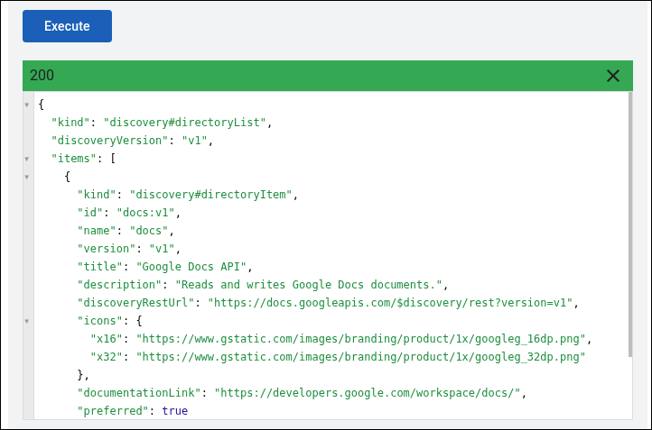
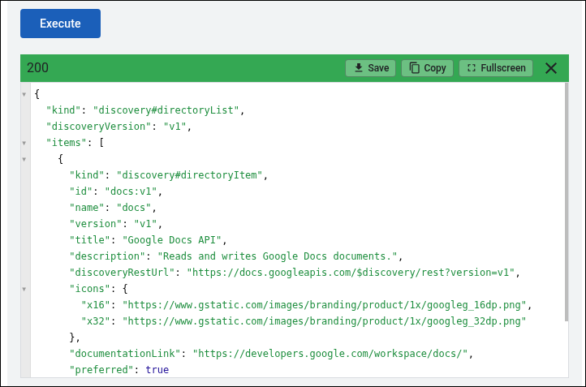

# Google APIs Explorer: Save, copy, and fullscreen response buttons

## Summary

Google's REST API reference pages on `developers.google.com` include an interactive **Try this method** panel (Google APIs Explorer). When you execute a request, the JSON result is rendered inside a small scrolling box at the bottom of the panel, with no built-in way to expand it, copy the full payload, or save it to a file.

This userscript adds three action buttons to the right side of the response status bar, works in both the docked side-panel view and the expanded modal dialog view, and reads the complete untruncated JSON response even when the CodeMirror viewer virtualizes off-screen lines:

* **Save** downloads the JSON response to disk as `<methodId>.json` (for example, `docs.documents.get.json`).
* **Copy** copies the full JSON response to the clipboard.
* **Fullscreen** expands the response pane across the entire browser tab (`Exit fullscreen`, the `×` button in the corner, or `Escape` returns to the normal view without clearing the response).

<!-- image-gallery-heading: **Response panel, before and after:** -->

**Response panel before:**



**Response panel after:**



## Visible changes

* Adds **Save**, **Copy**, and **Fullscreen** buttons to the response status bar (`200`, `400`, etc.) in Google APIs Explorer.
* **Save** triggers a browser download of the full JSON response named after the API method (`<methodId>.json`) and briefly flashes **Saved**.
* **Copy** writes the full JSON response to the clipboard and briefly flashes **Copied**.
* **Fullscreen** expands both the response pane and its outer `developers.google.com` iframe container to fill the browser tab (`100vw × 100vh`).
* While in fullscreen mode, clicking **Exit fullscreen**, clicking the status bar or tab-bar `×` close button, or pressing `Escape` restores the previous panel layout without discarding the response.

## Implementation

### Cross-origin iframe architecture

On `https://developers.google.com/*` reference pages, the **Try this method** widget (`<devsite-apix>`) embeds the APIs Explorer application inside a cross-origin `<iframe>` served from `https://explorer.apis.google.com/embedded.html?discoveryRestUrl=...&methodId=...` (with `allow="clipboard-write"` on the iframe element).

Because the response UI lives inside that cross-origin iframe while the iframe's bounding box is constrained by the parent `developers.google.com` page, the script matches both origins and omits `@noframes`:

1. **Inside `explorer.apis.google.com`** (`initExplorerFrame`), the script watches `<api-response>` with a `MutationObserver`, injects the **Save**, **Copy**, and **Fullscreen** buttons into `.status-bar`, reads the response payload, and expands `.single-tab-response` / `.multi-tab-response` to `100vw × 100vh` when fullscreen is active.
2. **On `developers.google.com`** (`initHostPage`), the script listens for a `postMessage` (`{ type: 'jshute-apix-fullscreen', fullscreen: boolean }`) from `https://explorer.apis.google.com` and toggles `.jshute-apix-fulltab` on the hosting container (`div.devsite-apix` for side-panel and modal dialog views, or `.apis-explorer` for inline embeds) and its `<iframe>`, promoting it to `position: fixed; inset: 0; width: 100vw; height: 100vh; z-index: 100000`. It then replies with an acknowledgement message so the child frame can call `CodeMirror.refresh()` once the iframe has resized.

> **Note on SourceMonkey:** SourceMonkey does not yet pass `allFrames: true` when registering scripts (see `docs/injection.md` under "No frame control"), so it currently only injects into the top-level `developers.google.com` frame and not the `explorer.apis.google.com` iframe. Until SourceMonkey adds subframe injection for scripts without `@noframes`, use Violentmonkey or Tampermonkey for this script.

### Observed DOM inside `explorer.apis.google.com`

Depending on panel mode, `<api-response>` renders one of two layouts:

* **Docked side panel / inline view (`.single-tab-response`):**
  ```html
  <api-response>
    <div class="single-tab-response">
      <div class="status-bar response-ok">
        <span class="response-code">200</span>
        <div role="button" class="close"><mat-icon class="material-icons">close</mat-icon></div>
      </div>
      <code-viewer id="response-body">
        <textarea id="code-viewer-response-body" style="display: none;">{ ... }</textarea>
        <div class="CodeMirror cm-s-default">...</div>
      </code-viewer>
    </div>
  </api-response>
  ```
* **Wide modal dialog view (`.multi-tab-response`, when `?apix=true` opens `.devsite-apix.dialog`):**
  ```html
  <api-response>
    <div class="multi-tab-response">
      <div role="button" class="close close-on-mattab"><mat-icon class="material-icons">close</mat-icon></div>
      <mat-tab-group>
        <!-- Tab 1: application/json, Tab 2: Raw HTTP Response -->
      </mat-tab-group>
      <!-- Inside active tab body: -->
      <div class="status-bar response-ok">
        <span class="response-code">200</span>
      </div>
      <code-viewer id="response-body">
        <textarea id="code-viewer-response-body" style="display: none;">{ ... }</textarea>
        <div class="CodeMirror cm-s-default">...</div>
      </code-viewer>
    </div>
  </api-response>
  ```

Note that resizing the `<iframe>` solely via CSS on the parent page does **not** cause Angular inside `explorer.apis.google.com` to switch between `.single-tab-response` and `.multi-tab-response` (that transition is driven by DevSite's own `postMessage` when clicking the native expand/collapse button in `.devsite-apix-controls`). In `.multi-tab-response`, switching between the `application/json` and `Raw HTTP Response` tabs destroys and recreates `.status-bar`, which the `MutationObserver` re-enhances automatically.

### Reading the full response text

CodeMirror 5 only renders visible lines in `.CodeMirror-code`, so reading `.CodeMirror-line` text nodes would truncate long responses. However, the Angular `<code-viewer id="response-body">` component keeps the full untruncated response string in the hidden `<textarea id="code-viewer-response-body">` element's `.value` property (as well as on the `.CodeMirror` instance via `cmElement.CodeMirror.getValue()`). `getResponseText()` reads `textarea#code-viewer-response-body.value` first, with `CodeMirror.getValue()` and `.CodeMirror-line` text as fallbacks.

### What we assume stays stable

* The parent page embeds the explorer in an `<iframe>` whose `src` is on `https://explorer.apis.google.com/*`, wrapped in `div.devsite-apix` or `.apis-explorer`.
* Inside the explorer frame, `<api-response>` contains `.single-tab-response` or `.multi-tab-response`, with a `.status-bar` child and a `<code-viewer id="response-body">` sibling/descendant.
* `<code-viewer id="response-body">` stores the raw response string in `textarea#code-viewer-response-body` (or exposes `.CodeMirror.getValue()`).
* The iframe URL query string carries `methodId=<service>.<resource>.<method>`, which we sanitize to form the `<methodId>.json` download filename.
