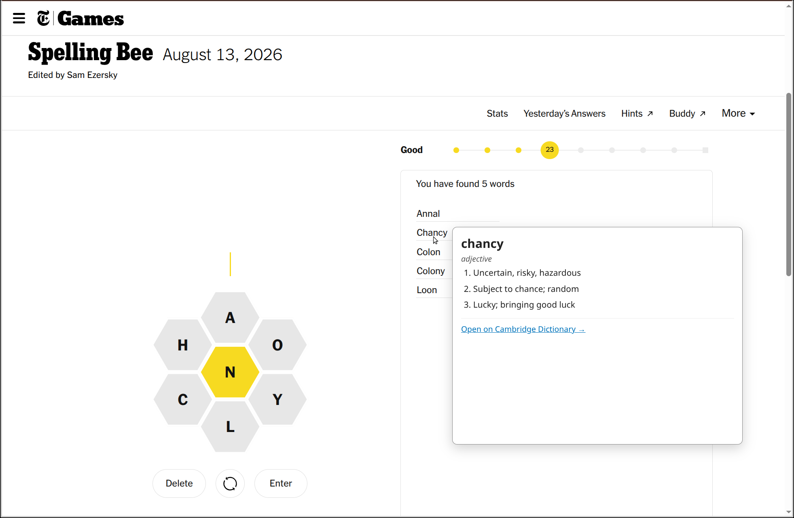

# NYTimes Spelling Bee: Word definitions and other tweaks

## Summary

Three quality-of-life tweaks for the New York Times' Spelling Bee
puzzle.

**Definitions for the words you find.** Hover or click words to see
a definition. Look up those weird words! Works on found words in the
puzzle, in the Buddy page, and in the "Yesterday's Answers" list.

**Link to Buddy.** Spelling Bee Buddy, the companion page that shows
hints with live status updates, isn't linked from the puzzle itself.
This adds a **Buddy ↗** link to the toolbar, next to **Hints ↗**.

**No splash screens.** Two annoying interstitial pages are auto-closed:
the "Welcome Back" screen when you start, and the congratulation screen 
shown when the puzzle is only partly done.

**Screenshot** (with a definition popup and the Buddy link in the toolbar):



## Visible changes

* "Welcome Back" splash and the rank-up "Genius / Keep playing"
  splash are auto-dismissed. The end-of-puzzle screen (Queen Bee
  and friends) is left alone.
* A **Buddy ↗** link is added after **Hints ↗** in the top
  toolbar, opening the Spelling Bee Buddy companion in a new tab.
* Found words on the main page and Buddy page become interactive
  (subtle `cursor: help`).
  - Hovering a word shows an inline definition popup.
  - Clicking a word pins the popup open (works on touch / when
    hover doesn't fire); clicking outside or clicking the same
    word again dismisses it.
  - The popup includes an "Open on Cambridge Dictionary →" link
    for the full entry.

## Implementation

### What the page looks like

The Spelling Bee page renders various "moment" overlays (welcome
back, congratulations, etc.) inside containers with the class
`pz-moment` plus a moment-specific modifier. The relevant elements
for the welcome splash:

- `.pz-moment__welcome` — outer container for the "Welcome Back"
  splash. Present in the DOM whenever this splash is being shown.
- `.pz-moment__welcome .pz-moment__button.primary` — the black
  Continue button inside the splash. The visible label is
  `Continue`; the button responds to a plain `.click()` and
  triggers the page's own dismissal logic.
- `.pz-moment__congrats` — outer container for the rank-up
  ("Genius!", etc.) splash that appears when the user crosses a
  rank threshold mid-game.
- `.pz-moment__congrats .pz-moment__close_text` — a top-right
  button with text "Keep playing" inside it. A plain `.click()`
  dismisses the splash.

**`.pz-moment__congrats` covers three different screens**, and only
two of them should be dismissed:

| | Rank-up splash | Welcome-back rank splash | End-of-puzzle screen |
|---|---|---|---|
| When | crossing a rank threshold mid-game | returning to a puzzle already at Genius | puzzle complete (e.g. Queen Bee) |
| Dismiss control | `.pz-moment__close_text` ("Keep playing") | `.pz-moment__close_text` ("Keep playing") | `.pz-moment__close` (an X) |
| Other buttons | — | "Share your achievement", "View all games" | "Share your achievement", "View all games" |
| Script behavior | click Keep playing | click Keep playing | leave it alone |

The welcome-back variant (observed 2026-09-14) is the trap: it has
the end-of-puzzle buttons too, so checking for those *first*
misclassified it as the end screen. The dismisser now looks for
"Keep playing" first and clicks it whenever it exists.

Observed on 2026-08-28: the Queen Bee screen carried
`class="pz-moment Congrats-module_moment__auGMZ pz-moment__congrats"`
with **no** `.pz-moment__close_text` anywhere in its subtree. Before
this was accounted for, that screen looked identical to "the Keep
playing selector broke", and the dismisser warned about it on every
mutation for as long as it was up.

When "Keep playing" is absent, `isFinalMoment()` identifies the end screen *positively*,
by a `.pz-moment__button` / `.pz-moment__button-group` descendant
whose text matches `/view all games|share your achievement/i` —
rather than inferring it from the absence of "Keep playing", which
would also swallow a genuine selector break. A congrats moment with
neither marker is still reported as a break.

Both dismissers warn at most **once per appearance** of their
overlay, re-arming when it disappears; they run from the
MutationObserver, so an unconditional warn fires continuously.

The splash is rendered after the main puzzle scripts hydrate, so it
isn't necessarily in the DOM at `document-idle`.

The top toolbar lives inside `.pz-toolbar-right` and contains
`Stats`, `Yesterday's Answers`, a `Hints` link, and a `More`
dropdown, in that order. The Hints link is the model we copy for
the Buddy item:

```html
<a class="pz-toolbar-button pz-toolbar-button__hints"
   href="..." target="_blank" rel="noreferrer">
  Hints<i class="pz-toolbar-icon external"></i>
</a>
```

The `.pz-toolbar-button` class supplies the typography and spacing,
and `.pz-toolbar-icon.external` is the small outgoing-link arrow
shown after the label.

The found-words panel renders each word as
`<li><span class="sb-anagram">word</span></li>` inside
`ul.sb-wordlist-items-pag`. Pangrams have an additional `pangram`
class on the span (and are rendered bold). New words are appended
to the same `<ul>` as the user finds them, without a full re-render
of the list.

The "Yesterday's Answers" modal renders each entry as
`<li data-testid="yesterdays-answer-word"><span class="check"></span><span class="sb-anagram">word</span></li>`
inside `ul.sb-modal-wordlist-items` — the `.sb-anagram` span is
still a direct child of an `<li>`, so the same `li > .sb-anagram`
selector matches it.

The Spelling Bee Buddy page is a separate Svelte app
(`https://www.nytimes.com/interactive/2023/upshot/spelling-bee-buddy.html`).
It renders **two** distinct found-word lists with **different**
markup:

**Bottom "You've already found:" tile list** — uses
`div.word-row.found`, with the word reconstructed from per-letter
divs:

```html
<div class="word-row svelte-XXXXXX found">
  <div class="word-container svelte-XXXXXX">
    <div class="word svelte-XXXXXX">
      <div class="letter svelte-XXXXXX">p </div>
      <div class="letter svelte-XXXXXX">e </div>
      ...
    </div>
  </div>
  <div class="checkbox-container ..."><button>Reveal clue</button></div>
</div>
```

**Top "You vs. Other Bee Buddy Visitors" bar-graph table** — uses
a different Svelte component, rendered as a `<table>`:

```html
<tr class="row user-found svelte-YYYYYY" aria-hidden="true">
  <td class="found-check ..."><span class="spelling-bee-icon ..."></span></td>
  <td class="word ...">hope</td>
  <td class="bar-group ...">...</td>
</tr>
```

In this table, the word is plain text inside a `<td class="word">`.
Pangrams add an extra class on the row (e.g. `.pangram`) but we
don't differentiate.

The bar-graph rows have a starting-letter tab control above them
(A / C / D / E / G / H / N — whichever letters apply to the
puzzle). Switching tabs **reuses the same `<tr class="row
user-found">` elements** and just updates the `.word` text and bar
widths in place; the row count and DOM identity stay the same.
That means our lookup handler must read the word at hover/click
time — caching the word at wire-up gives stale lookups after a
tab switch.

Combining the two, our buddy-page selector is
`.word-row.found, .row.user-found`. In both cases the word lives
inside a child element with class `.word`; reading
`.textContent` and stripping whitespace gives the lowercase word
in either case ("p e e p h o l e " → "peephole"; "hope" → "hope").

The `svelte-XXXXXX` suffixes are build hashes that change between
deploys, so we don't rely on them.

For the hover popup, there are two data sources, tried in order.
Both are keyless JSON APIs built on Wiktionary data, so the text
is short clean prose. The "Open on Cambridge Dictionary" link
inside the popup still points at Cambridge as the preferred
landing page when the user wants the full entry.

1. **freedictionaryapi.com**
   (`https://freedictionaryapi.com/api/v1/entries/en/<word>`) —
   primary. Returns `{word, entries[]}`, each entry with
   `partOfSpeech`, `pronunciations[]` (`{type: "ipa", text}`), and
   `senses[]` (`{definition, examples[]}`). An unknown word is a
   **200 with an empty `entries`**, not a 404.
2. **Datamuse** (`https://api.datamuse.com/words?max=1&md=d&sp=<word>`)
   — fallback, used when the primary errors out or doesn't know
   the word. Older and very stable, but has no pronunciation or
   examples. Returns `[{word, defs[]}]` with each def as
   `"<pos>\t<definition>"` (`n`, `v`, `adj`, `adv`, `u`). `sp=` is a
   *spelling pattern* and matches fuzzily — `xyzzyq` returns
   `xyzzy` — so the parser rejects a hit whose `word` differs from
   the query.

A source that **errors** (timeout, 5xx, unparsable body — not
"word not found") is demoted for the rest of the session: it moves
behind the healthy sources and is only consulted when they all come
up empty. Otherwise a dead primary would cost every new word the
full 3 s retry budget before the fallback got a turn. A demoted
source that later answers successfully gets its priority back.

Both sources draw on Wiktionary, whose text is licensed
[CC BY-SA 4.0](https://creativecommons.org/licenses/by-sa/4.0/) and
so asks to be credited when reproduced; Datamuse's definitions also
mix in WordNet. Neither API asks for anything itself (Datamuse
states it's usable without restriction up to 100k requests/day).
Each source carries an `attribution` line, rendered in small type
at the bottom of the popup, naming the data source, license, and
API.

To check a source on its own, add `?sbDictSource=<name or index>`
to the page URL (`?sbDictSource=datamuse`, `?sbDictSource=1`); the
init log confirms the pin, and every lookup then uses only that
source. Each source's raw JSON can also be viewed directly in the
browser at the URLs above. The `[spelling-bee]` console logs say
which source answered each word.

Each source's `parse` normalizes its response into the shape the
renderer uses: a list of `{phonetic, meanings: [{partOfSpeech,
definitions: [{definition, example}]}]}`. Only when every source
comes back empty does the popup show the "no definition" message
linking to the full Cambridge page.

**No longer used:** the Free Dictionary API
(`https://api.dictionaryapi.dev/api/v2/entries/en/<word>`). Its
JSON was natively the shape above, but as of 2026-09-15 it doesn't
respond at all (requests time out), and its server-side code
scrapes an internal Google Search endpoint that now returns 400,
so it isn't expected back. Don't reach for it again.

#### Retries, cache-busting, and timeouts

A CDN-fronted source can cache a transient **5xx** against the
exact URL, so one specific word then fails on every retry while
other words work fine. So `fetchWithRetries()` makes up to three
attempts per word per source:

* Attempt 0 uses the plain URL, so a *healthy* cache entry still
  gets used.
* Attempts 1 and 2 append a unique `_cb=<counter>-<timestamp>`
  param, 400 ms apart — a different cache key, which misses the
  cached error and reaches the origin.
* **Only 5xx and transport failures are retried.** Everything else
  ends the loop, including 404 and 429 (rate limited). Retrying a
  429 would be actively harmful: attempts 1+ bypass the CDN by
  construction, so a burst of hovers would send three requests to
  the origin apiece and deepen the rate limit instead of waiting
  it out.
* Transport failures (network error, timeout, no `GM_xmlhttpRequest`)
  carry a `TRANSPORT_FAILURE` sentinel of `-1` rather than `0`.
  That keeps them distinguishable from an `onload` that simply
  didn't populate `response.status` — some userscript managers
  omit it, and that case has to fall through to the JSON parse
  rather than be treated as a failed lookup.

`GM_xmlhttpRequest` has **no default timeout**, and when a
source's origin is down its CDN can take ~20 s to give up and
return a 522, so two things bound each lookup:

* `timeout: REQUEST_TIMEOUT_MS` (1.5 s) on every request, which is
  what makes the `ontimeout` handler reachable at all. Both
  sources answer in ~0.25 s when healthy, and there's no observed
  "slow but succeeds" regime — a lookup is either fast or it's a
  timeout — so a longer value buys no extra successes, only a
  longer wait before giving up.
* `LOOKUP_DEADLINE_MS` (3 s) for all attempts at one source. Each
  attempt's timeout is **clamped to the remaining budget**, so this
  is a real ceiling — checking the deadline only before starting a
  retry isn't enough, since an attempt begun just under it still
  runs its full timeout past it.

Resulting worst case for one dead source: attempt 0 times out at
1.5 s, attempt 1 is clamped to 1.1 s and ends at 3.0 s, attempt 2
is skipped — 3 s, after which the next source gets its turn (and
the dead one is demoted, as above, so later words don't wait).

The popup shows "Looking up <word>…" until the lookup resolves.
At a 3 s ceiling that needs no intermediate "service is slow"
state — an earlier version had one, and it was more code than the
wait justified.

Each attempt logs its status, so a persistent break is
distinguishable from a one-off blip in the console.

### What we assume

The script will break if any of these change:

1. The welcome-splash container keeps the class
   `pz-moment__welcome`.
2. The dismiss button stays inside that container with the classes
   `pz-moment__button primary`, and a plain `.click()` still
   dismisses the splash. Likewise the rank-up splash keeps
   `pz-moment__congrats` and a `.pz-moment__close_text` close
   button that dismisses it on click.
3. Visibility is reflected by the standard `offsetParent` /
   computed `display` / `visibility` checks (i.e. the page either
   removes the moment from the DOM or hides it via CSS, rather than
   leaving a visible-but-disabled stub).
4. The toolbar container keeps the class `pz-toolbar-right`, the
   Hints link keeps `pz-toolbar-button__hints`, and the
   `pz-toolbar-button` / `pz-toolbar-icon external` classes still
   provide the visual styling we piggy-back on for the Buddy link.
5. Each found word stays rendered as `.sb-anagram` inside an `<li>`,
   with the lowercase word as the span's text content. We also
   assume the page doesn't itself attach a click handler to the
   `.sb-anagram` span that we'd be clobbering by stopping
   propagation; the page's own per-row click affordances (e.g.
   Buddy's "Reveal clue" button) live on sibling elements, not
   the word itself.
6. On the Spelling Bee Buddy page, found-word rows keep the
   `word-row` + `found` classes, and the per-character `.letter`
   children of `.word` keep the lowercase characters as their
   text content (concatenated, with whitespace stripped, this is
   the word).
7. freedictionaryapi.com and Datamuse stay online and free, keep
   the JSON shapes described above, and report unknown words the
   way they do now (empty `entries`; fuzzy match to a different
   `word`). They also have to keep ignoring an unknown query param
   (`_cb=…`), since that's what the retry path relies on.
8. The URL match has `spelling-bee*` because sometimes it shows up
   with `?auth` arguments after the page.

### What we change

On `document-idle`:

1. **Initial attempt.** Run `tryDismissWelcome()` once in case the
   splash is already in the DOM.
2. **Watch for the splash.** Attach a `MutationObserver` to
   `document.documentElement` that watches childList/subtree
   mutations (to catch the moment being inserted) plus `style` /
   `class` attribute changes (to catch later visibility toggles).
   Each callback re-runs `tryDismissWelcome()`.
3. **Click Continue once visible.** `tryDismissWelcome()` looks up
   `.pz-moment__welcome`, confirms it's visible, then clicks the
   primary `.pz-moment__button` inside it. After the first
   successful click we set a `welcomeDismissed` flag so we don't
   re-trigger if the user navigates back to it within the same
   page load.
4. **Inject the Buddy toolbar link.** `tryAddBuddyLink()` finds
   `.pz-toolbar-right`, checks we haven't already injected (by
   looking for our own `.pz-toolbar-button__buddy` class), then
   builds an `<a>` with the same `pz-toolbar-button` styling plus
   the `pz-toolbar-icon external` arrow icon, and inserts it
   immediately after the Hints link via `insertAdjacentElement`.
   It re-runs from the same MutationObserver so it works even if
   the toolbar mounts after `document-idle`.
5. **Wire hover/click handlers onto the found-word elements.**
   `attachLookupHandlers()` runs in two passes:
   - **Puzzle page pass.** Iterate every `li > .sb-anagram` (this
     covers both the found-words panel and the Yesterday's Answers
     modal). Skip any `.sb-anagram` already marked with
     `data-sb-lookup-added`. For each new one, set
     `cursor: help` on the span and attach mouseenter / mouseleave
     / click listeners.
   - **Buddy page pass.** Iterate every `.word-row.found, .row.user-found`
     and find the inner `.word` element. Skip ones already marked.
     Reconstruct the word by reading `.word`'s text content with
     whitespace stripped, then attach the same handlers to the
     `.word` element directly.

   Both passes mark the word element itself (not the parent row)
   with `data-sb-lookup-added` so the MutationObserver callback
   is idempotent. The Buddy page is served from a different URL,
   so the userscript header has a second `@match` for it.

   The handlers behave as follows:
   - **Hover.** After a ~250 ms debounce, `fetchDefinition(word)`
     issues a `GM_xmlhttpRequest` to each definition source in
     turn until one has the word, normalizes the JSON response,
     and renders our own minimal HTML for the entries (word, phonetic, then a `meaning` section
     per part-of-speech with a numbered list of definitions and
     examples). The popup auto-hides on `mouseleave` (after a
     short grace period so the user can move into the popup
     itself).
   - **Click.** Pins the popup: shows it immediately and disables
     the auto-hide. This is the primary trigger on touch devices,
     where `mouseenter` / `mouseleave` don't fire reliably. We
     `stopPropagation` and `preventDefault` so the row's own
     handlers (e.g. Buddy's "Reveal clue" button) don't fire from
     the same click. A pinned popup is dismissed by clicking
     outside it (we listen on `document` in the capture phase) or
     by clicking the same word again, which toggles it off.

   The rendered HTML is shown inside an
   `<iframe srcdoc="...">` with
   `sandbox="allow-popups allow-popups-to-escape-sandbox"`
   (scripts off, but `target="_blank"` links can open new tabs)
   and a `<base target="_blank">` so the bottom "Open on
   Cambridge Dictionary →" link, plus any future links, open as
   new tabs. Successful results are cached in an in-memory `Map`
   keyed by word so subsequent hovers are instant; transient
   errors are evicted from the cache so they don't poison the
   session. The popup auto-positions next to the word and shares
   hide logic between the word and the popup, so the user can
   move into the popup without it disappearing.
