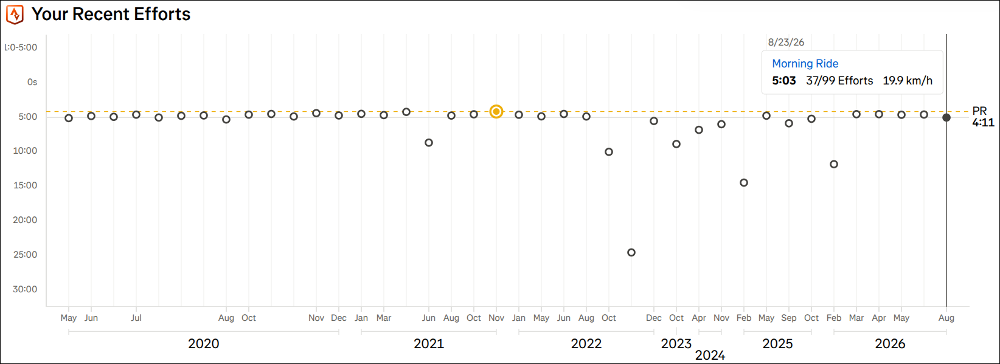
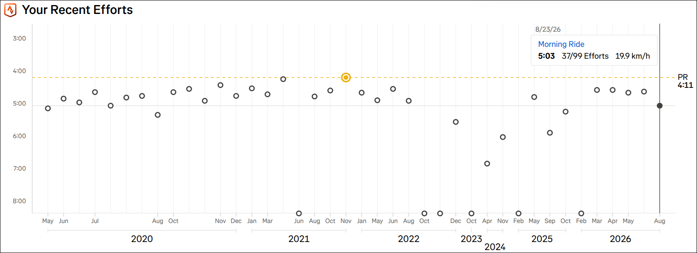

# Strava: Rescale segment my-efforts graph to handle outliers better

## Summary

The **Your Recent Efforts** chart on a segment page scales its time axis to
fit your slowest effort. One ride where you stopped on the trail, waited for
a gate, or chatted at the junction is enough to stretch the axis over tens of
minutes, and every other effort collapses into a flat line at the top where
no difference between them is visible.

This script caps the axis instead. Efforts slower than the cap are drawn on
the bottom axis, and everything else gets the full height of the chart to
spread out in. Nothing is hidden, and hovering an effort still shows its real
time — the chart is rescaled, not the data.

The cap is whichever is larger of:

* **2x your PR time** on the segment, so a segment where every effort is
  slow does not get magnified into noise; and
* **enough to include 80% of your efforts**, so a segment with a genuine long
  tail of slow rides does not end up with half its points pinned.

A chart that is already readable is left exactly as Strava drew it: if
capping would gain less than 1.5x more vertical resolution, the script does
nothing.

Only segment pages are affected, and only the recent-efforts chart on them.

<!-- image-gallery-heading: **The Your Recent Efforts chart, before and after:** -->

**Efforts chart before:**

**Efforts chart after:**

## Visible changes

* Slow outliers sit on the bottom axis instead of stretching it. They are
  drawn like any other effort — where they sit is what marks them out.
* The remaining efforts spread across the full height, so differences of a
  few seconds are visible.
* The time axis is relabeled to match the new scale. Strava's garbled
  negative tick (it renders -5:00 as `-1:0-5:00`) disappears with it.
* The PR line and its caption move with the rescale.
* Hover tooltips are untouched — a pinned effort still reports its true time,
  speed and rank.
* Charts without meaningful outliers look exactly as before.

## Implementation

### What the page gives us

The chart is a [visx](https://airbnb.io/visx/) SVG under
`[data-testid="segment-recent-efforts"]`, server-rendered by Strava's Next.js
app and hydrated by React afterwards. Within it:

* `circle.visx-circle` — one per effort, positioned by `cy`. The PR effort is
  drawn as two stacked circles (an `r=8` gold disc under an `r=5` ring) at one
  date, so circles outnumber efforts by one.
* `.visx-axis-left .visx-axis-tick` — each a `<g>` wrapping
  `<text y><tspan>label</tspan></text>`. Labels are `0s` and `M:SS`.
* `line[stroke-dasharray]` — the gold PR line, with its `PR` / time caption in
  two `<text>` elements alongside it in the same parent `<g>`.
* An undashed full-width `<line>` marking whichever effort is hovered.
* Short `<line>`s at a constant `y` under the date axis — the brackets drawn
  beneath each year label. These look like horizontal rules but carry no
  value; see the pitfall below.
* `rect.visx-bar` — full-height transparent hover targets, one per date.
* `.visx-axis-line` with `x1 === x2` — the vertical left axis, whose `y2` is
  the bottom of the plot area; the one with `y1 === y2` is the horizontal
  axis, whose `x2` is the plot's width.

Strava's own scale is a plain linear min-max fit: the fastest effort (usually
the PR) maps to the top of a fixed pixel band and the slowest to the bottom,
with no outlier handling. The `0s` gridline is not a baseline — it is just
where visx's nice-number tick generator lands, which is also why a chart with
a wide spread gets a tick below zero that Strava's formatter mangles.

### How the rescale works

The script never reads the page's embedded JSON. It recovers Strava's
time-to-pixel mapping from the axis Strava drew — two parsed tick labels give
the linear map exactly — and then reads every effort's time back out of its
`cy`. This was checked against the page data on two segments and recovers all
41 effort times to the second.

Reading the rendered chart rather than the JSON matters because Strava's
segment pages navigate client-side: after an in-app navigation the embedded
`__NEXT_DATA__` still describes whichever segment the tab was opened on, while
the axis always describes what is on screen.

With the map in hand it computes the cap, remaps each circle's `cy` onto the
capped scale, moves the PR line (shifting its caption by the same offset
rather than rescaling it), and relabels the axis. Ticks are drawn on the
*uncapped* scale over the whole plot area — the cap moves efforts, not the
axis they are read against.

The rescaled band keeps Strava's top edge, because the space above it is where
the hover tooltip is drawn, but runs down to the axis line rather than
stopping where Strava put its slowest effort, so a pinned effort is centered
on the axis. Strava reserves nothing down
there, so using it both puts pinned efforts where they read as pinned and adds
about 35% more height for everything else.

**Pitfall: not every horizontal line is a value.** The date axis draws a short
bracket under each year label, all at the same `y` in their own group. Moving
those as if they were times draws a gapped rule across the middle of the
chart. Only full-width rules — `x1` at the left edge, `x2` at the plot width —
carry a time.

### Staying applied

React rewrites the chart on hover and on resize, putting Strava's coordinates
back, so a `MutationObserver` re-applies. Two things make that safe:

* Every element we touch records both the value we wrote (`data-jshute-dst`)
  and the value Strava had before it (`data-jshute-src`). A re-read takes the
  stored original when the current value is still ours, so nothing is
  transformed twice, and a genuine re-render is picked up as fresh input.
* A tick's position and its label are stored as one unit. Reading Strava's
  `y` against our rewritten label (or the reverse) produces a scale that is
  wrong in a way nothing downstream can detect — this was a real bug during
  development, and the re-apply computed a nonsense cap from it.

Writes are skipped when the value is already correct: `setAttribute` notifies
the observer even when the value does not change, so an unnecessary write is
an infinite loop.

Deciding *not* to rescale is not the same as never having rescaled, so every
path that stands down first undoes any earlier pass — `data-jshute-attrs`
records which attributes an edit went to, so the undo does not need to know
what kind of element it is looking at. Without this, React handing the same
nodes to another segment's chart during a client-side navigation would leave
that chart with ticks hidden and dots moved, and no code path to put them
back. Only edits that are still ours are undone: an element whose value no
longer matches what we wrote has been re-rendered since, and React's value is
the one to leave alone.

Ticks are only ever repositioned, relabeled, or hidden. Nothing is inserted
into React's tree for a re-render to trip over, which is why the step is
chosen so the tick count fits the nodes Strava already rendered.

### Waiting for hydration

The first pass waits for the `load` event and then for the document to stop
mutating for 500ms. Editing a tick's text while React is still hydrating is a
hydration mismatch, and React responds by discarding the server's markup for
the entire page and re-rendering it client-side — verified as React errors
#418/#423/#425 in the console before this wait was added. The cost is that the
chart appears with Strava's scale for a moment before being adjusted.

The wait is capped at 4 seconds. Strava is not a quiet page — a map, ads and
lazy-loaded panels all mutate the document — and waiting for a quiet that
never comes would mean silently never rescaling at all.

The observer watches the whole document, because the chart's container is
replaced wholesale on navigation, but the scheduler returns immediately when
the path is not a segment page. Otherwise every page on the site pays for
timers it can never use.

### What we assume stays stable

* The section is identifiable by `[data-testid="segment-recent-efforts"]`.
* Efforts are `circle.visx-circle` positioned by `cy`, one date per `cx`.
* Left-axis ticks are `.visx-axis-left .visx-axis-tick` containing a
  `<text y>` and a `<tspan>` whose text is `0s` or `M:SS`.
* The PR line is the only horizontal `line[stroke-dasharray]`, and its caption
  shares its parent `<g>`.
* The vertical `.visx-axis-line` marks the bottom of the plot area.
* The y scale is linear in elapsed seconds, increasing downward.

If the axis becomes unreadable (fewer than two parseable ticks) the script
logs and leaves the chart alone rather than guessing.

### Tuning

`PR_MULTIPLE`, `COVERAGE` and `MIN_GAIN` are constants at the top of the
script. Setting `MIN_GAIN` to 1 makes it rescale every chart, which will pin
up to 20% of efforts on every segment because the coverage rule guarantees
it.

The thresholds look aggressive written down — up to a fifth of efforts can end
up on the axis — but the efforts they pin are usually not rides at all. A
segment's slow tail is dominated by tracks that kept recording after the rider
stopped: a gate, a mechanical, a chat at the junction. Those minutes are
recording artifacts rather than riding, so a scale that reserves most of the
chart for them is spending its height on the least meaningful data it has.
That is the case for pinning a continuum of slow times, not just the obvious
lone outlier.
