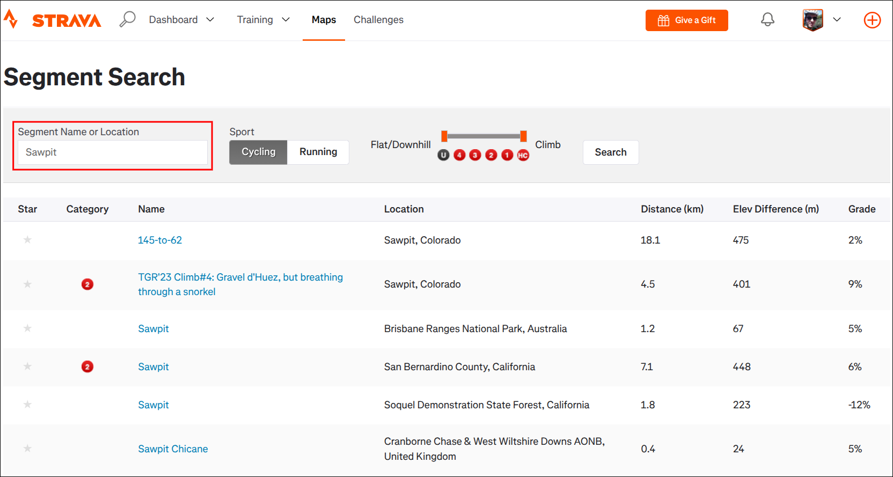
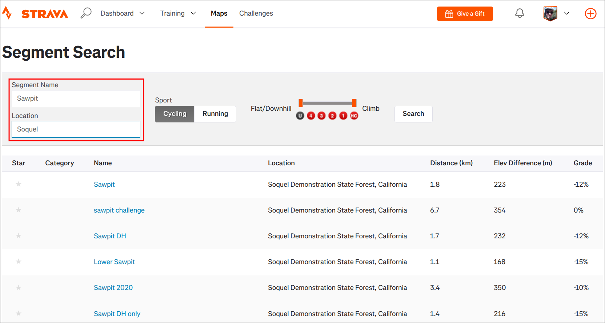

# Strava: Segment search location filter

## Summary

Adds a **Location** box to Strava's segment search, so a name search
like "south leaf" can be narrowed to the segments that are actually
where you ride, instead of returning similarly-named trails worldwide.
Strava's own keyword box does no location filtering at all — extra
words like "california" don't restrict anything.

The filter runs in the browser over the Location column of the results
table. Because Strava paginates results 30 at a time (a common query
has hundreds of pages), the script also replaces Strava's paginator
with one growing list: it fetches following result pages in the
background and merges their rows into the table you're looking at.

**Search page before:**

**Search page after:**

The global header search gets the same treatment when its mode
dropdown is set to Segments.

**Title bar before:**

**Title bar after:**

## Visible changes

* **Segment search page** (`/segments/search`): a **Location** box
  appears under the keyword box. Typing in it filters the results
  immediately; non-matching rows are hidden. Strava's own label is
  retitled from "Segment Name or Location" to just "Segment Name", so
  the two boxes don't claim the same job.
* **Strava's paginator is replaced** by one growing list of results.
  Below the table sits a control bar showing what's loaded so far and
  a link to load more — e.g. "56 results loaded (pages 1–2 of 4)
  · Load more results". This works with or without a location filter,
  so the results page reads as a scrolling list rather than pages.
* With a filter set, that control loads results in bursts of 10 pages
  and reports matches — "Location filter: 43 matches in 108 results
  (pages 1–4 of 4) · Search 10 more pages" — with a **Stop** link
  while it's working and "End of results." when there's no more.
* Pressing **Enter** in the Location box (or arriving with a location
  already set) kicks off that search automatically. If any part of the
  search has been edited since the page loaded — keyword text, the
  Cycling/Running switch, the climb-category slider — Enter instead
  re-runs Strava's search from page 1, because the loaded rows answer
  the old search.
* Clearing the Location box reveals everything loaded so far, rather
  than dropping back to a single page.
* **Global header search**: with the mode dropdown set to *Segments*,
  a second **Location** box appears next to the keyword box. Searching
  from there lands on the results page with the location filter
  already applied. Leaving it empty leaves Strava's own search
  behaviour completely untouched, as does picking a specific segment
  from the suggestion dropdown — that still jumps straight to the
  segment, location box or not.

### Matching semantics

The filter text is split on commas into terms, and a result is shown
only when **every** term appears somewhere in its Location text
(substring match, so `calif` matches `California`). Comparison is
case-insensitive, accent-stripped, and whitespace-normalised.

`el corte de madera, california` therefore means "location contains
both of these", which is the useful way to combine a park/city with a
state or country.

## Implementation

### What the page gives us

`/segments/search` is a classic server-rendered Rails page — no SPA
routing — so the script just runs once per page load at
`document-idle`. The pieces it depends on:

* `form.search[action="/segments/search"]` containing
  `div.inline-inputs#segment-search`, whose first `` holds the
  `label` + `input#keywords` pair. Our label and input are appended
  to that same ``, which stacks them under the keyword box.
* `table.search-results` with a `thead` whose columns are Star,
  Category, Name, **Location**, Distance, Elev Difference, Grade, and
  one `tbody tr` per result. The Location column is located by header
  text rather than a fixed index (index 3 is the fallback); the
  Running results table happens to use the same columns today.
* `nav ul.pagination a[href]` — page links carrying the full query
  plus `page=N`. We hide that `<nav>` (rather than removing it): its
  links are still how we learn the last page number, which is what
  stops loading at the end of the result set. Our control bar is
  inserted immediately before it, so it lands where the paginator
  was.

Verified against the live site: **the server ignores unknown query
params**, so our `loc=` parameter can ride along in the form submit
without changing what Strava returns. That is what makes the filter
shareable and bookmarkable: the location `<input>` is `name="loc"`, so
Strava's own Search button round-trips it back into the URL, and the
script re-applies it on load.

The global header search widget (present on every Strava page) is:

* `form#global-search-bar` → `#global-search-filter` (a Bootstrap
  dropdown whose button carries `data-value="activities|athletes|
  clubs|segments"`), `input#global-search-field`, and the
  `#global-search-button` / `#global-search-cancel` buttons inside a
  `.input-group`.
* Our Location input is inserted into that `.input-group` right after
  `#global-search-field`, and is shown only while `data-value` is
  `segments` (a MutationObserver on that attribute follows the
  dropdown).
* The suggestion dropdown is a jQuery UI autocomplete under
  `#global-search-autocomplete-container`; the highlighted entry
  carries `ui-state-focus`. Its first entry,
  `#global-search-menu-header` ("Search segments: …"), means "run the
  search" and is ours to take over; every other entry links to one
  specific segment, so Enter there is left to Strava.
* Strava's own Segments search navigates to
  `/segments/search?utf8=✓&keywords=…&gsf=1`, so when we take over we
  build the same URL and append `loc=`. We only intercept (capture
  phase, on Enter / search-button click / form submit) when the mode
  is Segments *and* our Location box is non-empty — otherwise Strava's
  handlers run untouched.

### Re-running the search

Enter in the Location box normally filters in place, but the search
itself may have been edited first — and Strava's sport switch and
climb slider only update hidden inputs (`filter_type`, `min-cat`,
`max-cat`, `terrain`), leaving the stale results on screen.

So at init we snapshot the whole form (`FormData`, minus our `loc` and
Rails' `utf8`, normalised and sorted) — that snapshot *is* the search
these results answer, whether or not the URL spelled every param out.
Enter compares against it and, if anything differs, calls
`requestSubmit()` on `form.search` instead of filtering. The form has
no `page` field, so the new URL starts at page 1; our Location input
is `name="loc"` inside that form, so the filter rides along and the
freshly loaded page re-applies it.

### Loading later result pages

Loading more (auto-started when the page loads with a non-empty `loc`,
or on Enter in the Location box, or via the control bar link) fetches
`?…&page=N` for the following pages with `credentials: 'same-origin'`,
parses each response with `DOMParser`, and appends the rows into the
live `tbody`, tagged `data-jshute-from-page="N"`. A burst is 1 page
with no filter set (a plain "load more") and 10 pages with one set —
a filtered page often contributes no matches, so one-at-a-time would
be tedious. There's a 300 ms gap between fetches.

Loading stops at the last paginator page, on a fetch error, or when a
fetched page has no result rows. That last case needs care: past the
end Strava serves a genuine search page with no results table, but a
response with no `form.search`/`#keywords` at all is something else —
an expired session redirecting to login, say — so we check for those
markers and only claim "End of results." for a real search page.
Anything else stops with a log line pointing at the session.

Two edge cases fall out of the paginator being our source of truth for
how many pages exist: a search with no hits has no results table, so
the Location box is still added (it round-trips into the next search)
but nothing is filtered or loaded; and a search whose results fit on
one page has no paginator at all, which we treat as "this is the only
page" rather than offering a load-more that fetches nothing.

Why replace the paginator rather than keep it: once rows from later
pages are merged into the current table, Strava's "2" link would load
a page whose results are already on screen, and would throw away the
rest. One growing list is the only consistent state.

Rows are only ever hidden by the filter, so clearing the box shows
everything loaded. Star icons on imported rows are inert — Strava
binds its star handlers at page load — so they're given a default
cursor and a tooltip saying to open the segment instead.

### What we assume stays stable

* Path `/segments/search`, and that it stays server-rendered per page
  load (no SPA URL handling is implemented).
* `input#keywords` inside the search form, for anchoring our field.
* `table.search-results` with a `thead` cell reading "Location".
* `nav ul.pagination a[href]` with a `page` query param (both to
  count pages and as the anchor our control bar replaces).
* Unknown query params (`loc`) continue to be ignored by the server.
* Header widget IDs: `#global-search-bar`, `#global-search-field`,
  `#global-search-button`, and `#global-search-filter`'s button
  carrying `data-value`.

Every step logs under the `[strava-loc]` prefix: init, field
insertion, hiding the paginator, filter application, load start/stop,
and fetch failures. If the script breaks, the first missing log line
identifies which of the anchors above moved.
