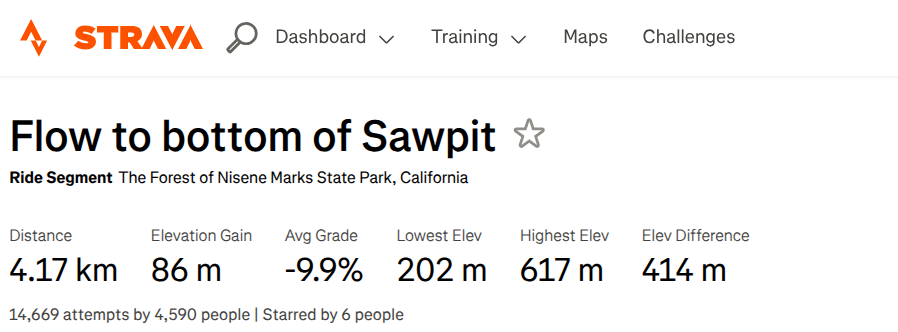
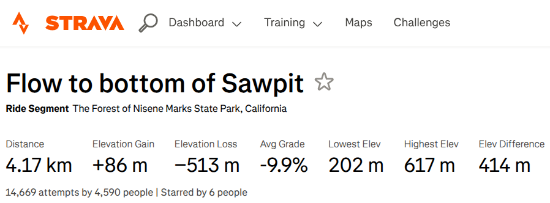
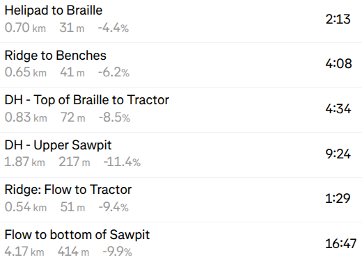
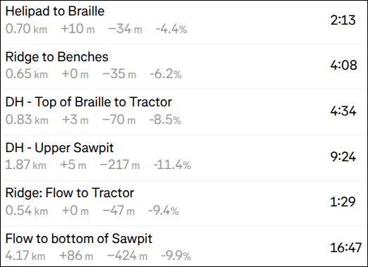

# Strava: Show elevation gain *and loss* for each segment

## Summary

Adds **elevation loss** next to the elevation gain Strava shows for a
segment, and labels both with `+` and `-` so it's clear which is
which.

Strava reports climbing for a segment but never descending.
The elevation figure on the activity page isn't even the climbing number; it's
the range of min to max elevation, unsigned.

This script shows gain and loss side by side on both segment and
activity pages. It also works around a Strava bug where the gain is
sometimes reported as zero: when that happens, it recomputes the real
figure.

Everything is derived from the elevation profile the page has already
loaded — nothing extra is fetched.

### Screenshots

**Segment page before:**



**Segment page after:**



**Activity page before and after:**

<table>
  <tr><td><b>Before</b></td><td><b>After</b></td></tr>
  <tr>
    <td></td>
    <td></td>
  </tr>
</table>

## Visible changes

### Segment page (`/segments/<id>`)

| Stat | Before | After |
|---|---|---|
| Elevation Gain | `1,452 m` | `+1,452 m` |
| Elevation Gain, where Strava reports 0 | `0 m` | `+327 m` — ours |
| **Elevation Loss** | *absent* | `−741 m` — ours, new stat |
| Elev Difference, Avg Grade, everything else | | unchanged |

### Activity page, collapsed effort rows

Both the main segments table and the hidden-segments one.

| Part of the row | Before | After |
|---|---|---|
| the elevation figure | `501 m` | `+507 m −9 m` |
| — where Strava reports 0 | `318 m` | `+328 m −7 m` — both ours |
| Distance, Avg Grade, everything else | | unchanged |
| the expanded panel's `Elev Diff` | `93 m` | unchanged |

The expanded panel is deliberately left alone: its only elevation row is
the same Elev Diff, and gain/loss there would just repeat the row above.

### How each new value is computed

| Value | Source | Method |
|---|---|---|
| Gain, both pages | Strava's published segment gain | theirs, server-side, untouched apart from the `+` |
| Gain, where Strava reports 0 | segment profile *or* this ride's stream | sum of every rise ≥ 1 m |
| Loss, segment page | the segment's elevation profile | sum of every drop ≥ 1 m |
| Loss, activity row | this ride's altitude stream, sliced to the effort | sum of every drop ≥ 1 m |

Each figure carries its own tooltip, naming the quantity and where it
came from:

| Figure | Tooltip |
|---|---|
| Activity row, gain | "Elevation gain (from segment)" |
| Activity row, gain where Strava reports 0 | "Elevation gain (summed from this ride; Strava reports 0)" |
| Activity row, loss | "Elevation loss (summed from this ride)" |
| Segment page, gain | *none* — Strava's own number, untouched but for the `+` |
| Segment page, gain where Strava reports 0 | "Elevation gain (summed from segment profile; Strava reports 0)" |
| Segment page, loss | "Elevation loss (summed from segment profile)" |

The unit inside each figure keeps Strava's own `<abbr title="meters">`,
copied verbatim from the element we replace — so hovering the unit shows
their abbreviation expansion, exactly as it did before. That nesting is
Strava's, not something added here.

Nothing is fetched for any of this. If the elevation stream never
arrives, the page is left exactly as it was and the script says so in
the console.

### Which numbers are whose

**Gain is Strava's** wherever they publish a non-zero one. Their
server-side figure is total climbing for the segment, computed with
smoothing we can't reproduce.

**Loss is always ours** — Strava publishes no loss figure anywhere.

Two things loss is *not*:

* **Not net difference.** Net is end-minus-start, which is zero for any
  effort finishing where it started, however much descending it did.
  Total descent costs the same to compute — one pass over the same
  slice.
* **Not max − min.** That's the elevation *range*: on a climb it equals
  the gain. The "Caribou Climb" effort has a range of 505 m while
  descending 9 m, so reporting the range as loss would describe a 500 m
  ascent as a 500 m descent.

### Strava's zero-gain segments

Some segments carry `elevGain: 0` on the segment record itself — not a
field the effort payload drops; their own segment page shows `0 m` too.
Of the 24 such efforts on the ride this was built against:

* **22 are correct** — pure descents, uncategorised, where the ride
  climbed 20 m or less.
* **2 are wrong**, and visibly so:

  ```
  /segments/15484388  "5 Points to Single Track"  Cat 3  Gain 0 m  Diff 318 m  7.5%
  /segments/2138078   "South Sourdough Climb"     Cat 3  Gain 0 m  Diff 190 m  7.0%
  ```

So a zero is replaced with a gain summed from the same profile, on both
page types. That's safe because the summation reproduces Strava's own
published gain closely — measured across the 17 segments of that ride
where they publish a non-zero figure:

| | |
|---|---|
| Worst absolute error | 12 m |
| Within 5 m | 15 / 17 |
| Systematic bias | −0.13% |

For the two broken segments it yields +327 m and +190 m, matching their
own high − low (318, 190). Where the zero is genuine the substitute is
also ~0, so nothing changes visibly.

The same measurement fixes the noise threshold empirically rather than
by taste — raw summation over-counts jitter (+11.9% bias), a 2 m
threshold swallows real climbing (−13.6%), and 1 m is near-unbiased:

| threshold | mean abs error | bias |
|---|---|---|
| 0 m | 11.9% | +11.9% |
| **1 m** | **5.1%** | **−0.1%** |
| 2 m | 13.6% | −13.6% |

(The large *percentage* errors all sit on segments with 20 m of gain,
where 1 m is 5%. In metres nothing drifts past 12 m.)

### One asymmetry worth knowing

On an **activity** page, Strava's gain describes *the segment* while our
loss describes *your ride through it* — the segment's own loss is only
available on the segment's page, one fetch per segment, which isn't
worth it for 49 rows. The two differ only by GPS noise: for Caribou
Climb the segment's profile loses 5 m and the ride's trace lost 9 m.
The hover text names the source of each. On a **segment** page there's
no asymmetry: both numbers come from the same profile.

## Implementation

### Activity pages — what the page gives us

Activity pages are the classic Rails/Backbone ones, with a global
`pageView`. Two things it holds are all this needs, and both are loaded
before the script runs:

* `pageView.segmentEfforts()` — **every** effort, preloaded in an inline
  `reset({...})` call, not fetched per row. Each carries `start_index`,
  `end_index` and `elev_gain`. Efforts the athlete hid are *not* in the
  collection; they sit in a plain array at
  `pageView.segmentEfforts().hiddenSegmentEfforts`, and are folded in so
  the hidden-segments table gets the same treatment.
* `pageView.streams().getStream('altitude')` — the whole activity's
  altitude stream, fetched once for the chart at the top of the page.

The indices are into the 1 Hz sample stream, confirmed by checking slice
sizes against each effort's `elapsed_time_raw`: 4404 points vs 4407 s,
1422 vs 1421, 756 vs 755, 1215 vs 1214. (The distance covered by a slice
runs a few percent longer than the segment's official distance — GPS
path vs. surveyed segment — which is expected and doesn't affect
elevation.)

This means a **collapsed row is no more expensive than an expanded
one**. Nothing about the effort is withheld until you expand it; only
the detail panel's rendering is deferred.

Both numbers on an effort row are properties of the **segment**, not of
the ride — verified by fetching the segment behind one: segment 1474331
reports `high − low = 500.8` and `elevGain = 507.2`, and the effort row
showed `elev_difference = 501`, `elev_gain = 507`. They are identical
for every athlete who has ridden it.

DOM anchors:

* `tr[data-segment-effort-id]` — the effort id maps a row straight to
  its record. Used by both tables (`table.segments` and
  `table.hidden-segments`).
* `td.name-col .stats span[title="Elevation difference"]` — the figure
  we replace. Its `<abbr class="unit">` is reused verbatim for our
  numbers, so our unit label can never disagree with the page's.

### Segment pages — what the page gives us

The segment page is Next.js, so the payload is in `__NEXT_DATA__`:

* `props.pageProps.streams.elevation` — the same stream that draws the
  profile chart. Verified as the source behind the stats: its min and
  max reproduce the page's Lowest/Highest Elev exactly (540.6 / 1241.1),
  and the paired `distance` stream reproduces the segment distance.
* `props.pageProps.measurements.elevGain` is the precomputed gain the
  page displays. There is no loss field anywhere in the payload — the
  only "Elevation Loss" string in the bundle belongs to the route
  builder's i18n, not the segment's.

The stats row is `ul[class*="SegmentStats_stats"]`, with each stat an
`li > div[class*="Stat_stat"]` holding a `[class*="Stat_statLabel"]` and
a `[class*="Stat_statValue"]`. Those are CSS-module names whose hashes
rotate every deploy, so they're matched by prefix, and our new stat is a
**clone of the Elevation Gain `li`** — that way the exact class hashes,
including any that change, come along for free. The clone's
`data-testid` is stripped so it can't be mistaken for Strava's own.

`Elev Difference` is left untouched and unsigned on purpose: it is a
range, so a `+`/`−` on it would be a lie about a quantity that has no
direction.

### Units

Streams are metres, and the page's own unit label says what the athlete
sees, so a `feet` label triggers a 3.28084 conversion. Strava's published
gain is already in display units and is not converted. As a check on
that assumption, the activity path compares Strava's `elev_difference`
against our max − min for the same slice across all efforts; those
should be near-equal, so a median ratio outside 0.75–1.33 logs a warning
that the units or the field's meaning have changed. This is the one
place where max − min is the right quantity to compute.

### Staying applied

A debounced `MutationObserver` on `document.body` re-runs the pass, since
sorting, unhiding a segment, or React re-rendering the segment stats will
undo the work.

**Markers go on the elements whose content we own, never on a container
that outlives them.** An earlier version marked a container and silently
failed: Strava re-rendered it *after* insertion, wiping the inserted
content while the marked container survived, so the repair pass saw the
marker and skipped. The row check now marks the `<span>` it rewrites and
the segment check marks the value element it signs. All of it is then
self-healing: if Strava wipes our work, the marker goes with it and the
next pass redoes it.

On the segment page the two edits — signing the gain and adding the loss
— are also checked **independently**, because React can replace the gain
stat while our cloned loss survives. Sharing one guard meant the
surviving loss short-circuited the check and the fresh gain never got
re-signed. The gain also has any existing sign stripped before it is
re-signed, so a lost marker can't compound into `++1,452 m`.

Startup waits for the elevation stream by polling every 250 ms for up to
20 s, because it's fetched asynchronously after the document is ready.
Giving up is logged rather than silent.

### What we assume stays stable

Activity pages:

* `pageView` exists in page scope — the script must be `@grant none` to
  see it.
* `pageView.segmentEfforts()` (Backbone collection, plus
  `.hiddenSegmentEfforts`) with `start_index`, `end_index`, `elev_gain`
  and `elev_difference` per effort.
* `pageView.streams().getStream('altitude')` returning the activity's
  full-length altitude array in metres, indexed the same way.
* `tr[data-segment-effort-id]`, `td.name-col .stats`, the
  `span[title="Elevation difference"]`, and `abbr.unit` inside it.

Segment pages:

* `__NEXT_DATA__.props.pageProps.streams.elevation` stays embedded in
  the document.
* The stats row keeps the `SegmentStats_stats` / `Stat_statLabel` /
  `Stat_statValue` class-name prefixes, and an "Elevation Gain" stat to
  clone and sit beside.

Logging is under the `[strava-elev]` prefix: init, how many rows were
updated and how many fell back to our own gain, rows updated after a
re-render, the segment stat's value, giving up on the stream, and the
unit sanity-check warning.
