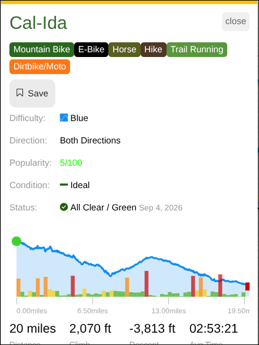
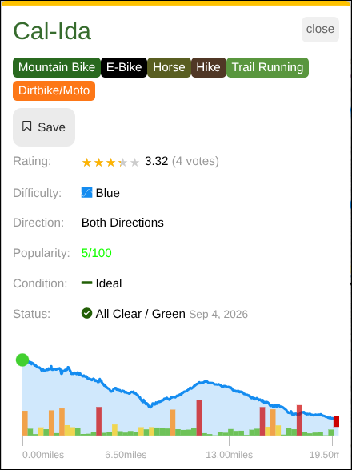

# Trailforks Map: Show star rating in trail popups

## Summary

Clicking a trail on a Trailforks map opens a summary popup with the trail's
difficulty, popularity, status, elevation profile, and other links.
The one thing it leaves out is the star rating, which is often the thing that's
most useful to see.

This script adds a `Rating:` row to the popup, with the star rating and vote count.

Trailforks might be replacing this popup with a newer side panel,
which does show a rating. The script only touches the older popup, so it stays
out of the way wherever the new panel is already in use.

<!-- image-gallery-heading: **Map popup, before and after:** -->

<table>
  <tr><td><b>Before</b></td><td><b>After</b></td></tr>
  <tr>
    <td></td>
    <td></td>
  </tr>
</table>

## Visible changes

* Trail popups on the map gain a `Rating:` row at the top of the info list,
  showing stars, the average out of 5, and the vote count.
* Trails nobody has rated show `Rating: not rated`.
* The row appears a moment after the rest of the popup, since the rating is
  requested separately. Reopening a trail you already looked at is instant.

## Implementation

### Where the popup comes from

Clicking a trail runs `tfmap_feature_click` in Trailforks' `mapbox.min.js`,
which calls their generic AJAX shim:

```js
pb.rmsSend({mod: 'trailforks', op: 'marker_info', layer, nid, type, name,
            maptype: 'mapbox', activitytype, properties}, cb)
```

`pb.rmsSend` (in `pblib.js`) POSTs `rmsP=j1&rmsD=<urlencoded JSON>` to
`/rms/index.php` — RMS is Trailforks' internal "remote method" endpoint — and
the response `{rmsD: {content, outsideContent}}` is server-rendered HTML that
`showInContentWindow()` drops into `#mapWindowContent` (the popup) and
`#outsideContent` (the yellow "Routes with this trail" strip below it).

So there's no client-side data to read a rating from: the response HTML has no
rating in it, and the map's vector-tile feature properties are only
id/name/type/colour/activity type. Of the RMS ops in their JS the only
rating-related ones (`rating`, `remove_rating`) submit a vote — there's no
read-only equivalent.

### Where the rating comes from

The same `marker_info` request, asked again with one extra parameter:

```js
pb.rmsSend({...sameParams, panel: 'detailpanel'}, cb)
```

That's the newer detail-panel template, which Trailforks itself uses on pages
that have `#tfMapFloatpanel` (the general `/map/` page, for instance, as
opposed to a region's `/region/<alias>/map/`). Its HTML includes the trail
page's rating widget:

```html
<ul id="trail_31559" data-id="31559" data-type="trail"
    data-rating="8" data-score="79.7" title="3.99 / 5 with 2 votes">
```

We read the `title`, which has both numbers; `data-score` (the average on a
0–100 scale) is the fallback, and shows the average without a vote count since
that path has none. An unrated trail's title is just `"0 / 5"`, with no vote
clause, and is the only thing shown as "not rated" — a response we can't read
at all is reported to the console and leaves the popup alone, rather than
claiming nobody has voted.

Fetching the trail's own page would work too, but the detail-panel response is
about a tenth the size and comes back with the map's current activity type
already applied. `/votes/trail/<nid>/` looks cheaper still but is unusable:
it's a paginated list of individual voters with no aggregate.

### How we modify the page

The script wraps `pb.rmsSend`. When the page asks for a trail marker *without*
a `panel` — i.e. the legacy popup — we fire our own copy of that request with
`panel: 'detailpanel'` alongside it, so both are in flight at once. This is
also what keeps the script inert on the newer panel: those requests already
carry `panel`, and already show a rating.

Wrapping their function, rather than rebuilding the request from the popup's
DOM, means we inherit the exact `nid`, `layer` and `activitytype` the map used,
and it works whether or not you're signed in.

When the rating arrives we insert a `Rating:` `<li>` at the top of the popup's
`ul.infolist`, reusing the `label grey` class the other rows use. Trailforks
rebuilds the popup's contents on every map click, and our rating can arrive
before or after them, so a `MutationObserver` on `#mapWindow` retries the
insertion.

Which rating goes into which popup is decided from the popup itself, not from
whichever trail was clicked most recently: each answer is stored with the trail
alias found in its own response, and only goes into a popup whose "view trail"
link points at that alias (falling back to matching the trail name in the
heading). Clicking through trails faster than the requests come back would
otherwise be enough to show one trail's rating on another's popup. Ratings are
cached per trail id for the life of the page; a lookup that came back
unreadable is deliberately not cached, so the next click tries again.

Stars are drawn as two stacked rows of `★` glyphs — grey underneath, gold on
top clipped to the rating's width — from our own injected `<style>`. That
renders fractional ratings exactly and doesn't depend on Trailforks' own star
CSS being present on map pages.

### What we assume stays stable

* `pb.rmsSend` is the site's AJAX entry point, and trail popups go through
  `op: 'marker_info'` with `type: 'trail'`.
* `panel: 'detailpanel'` selects a template that includes the rating widget,
  and its response links back to the trail's own page at
  `/trails/<alias>/…`.
* A successful RMS response is marked by a truthy `rmsS`, with the HTML in
  `rmsD.content` (or in `rmsD` itself, when that is a string).
* The rating widget is `.star-rating ul[data-type="trail"]`, with a
  `data-score` attribute and a `"<avg> / 5 with <n> votes"` title.
* The popup container is `#mapWindow`, its body `#mapWindowContent`, the trail
  summary inside it has class `marker_info`, and it contains an `a.viewtrail`
  link and a `ul.infolist` of label/value rows.

Trailforks isn't a single-page app — each page is a document load — so the
script doesn't need `window.onurlchange`. It waits briefly for `pb` and
`#mapWindow` at startup and stands down on pages without them.
